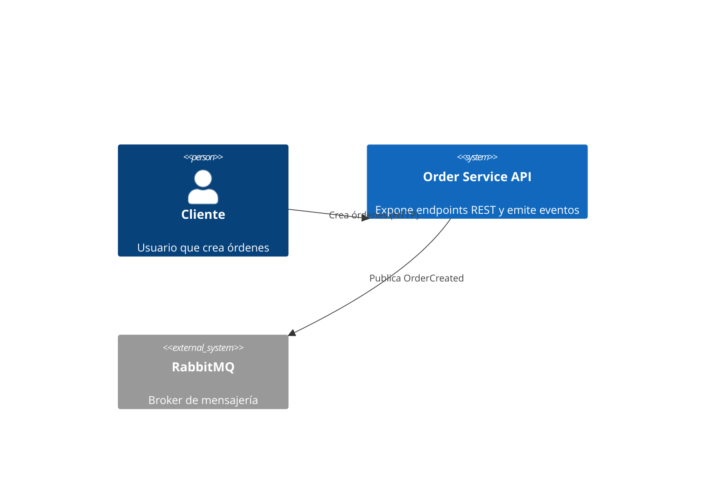
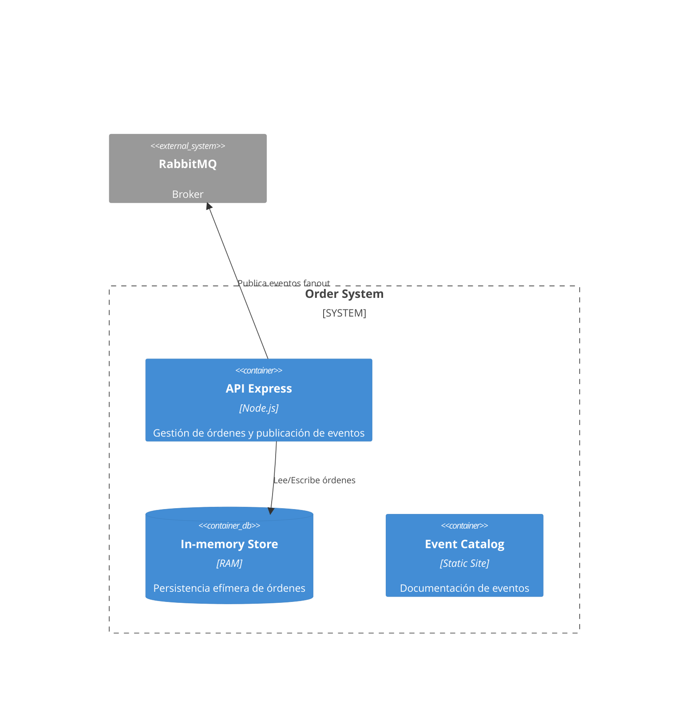
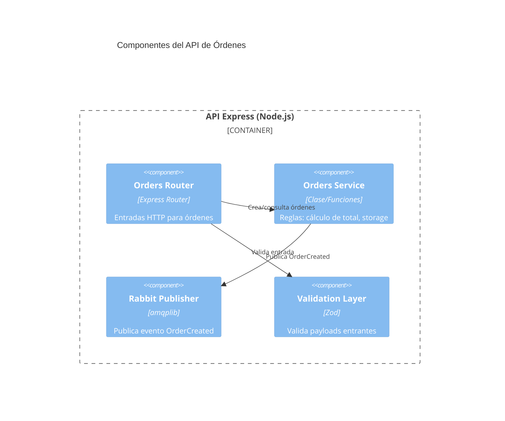

# 🧱 Proyecto: C4Model + OpenAPI + Event Catalog + Arquitectura Orientada a Eventos

Este repositorio contiene un ejemplo pedagógico completo que integra:

- API REST en **Node.js + TypeScript + Express**.
- Documentación **OpenAPI 3.0 (Swagger)**.
- **RabbitMQ** para publicación/consumo del evento `OrderCreated`.
- **Event Catalog** para documentar eventos y sus productores/consumidores.
- Diagramas **C4Model** con **Mermaid**.

> Objetivo educativo: brindar una guía práctica + teórica para estudiantes avanzados sobre cómo combinar documentación de arquitectura y especificaciones API/eventos.

## Índice
1. Introducción a Markdown
2. Arquitectura general del sistema
3. C4Model (Niveles + ejemplos Mermaid)
4. OpenAPI vs C4Model vs Event Catalog (cuándo usar cada uno)
5. API REST: Endpoints y flujo
6. Evento `OrderCreated` y arquitectura EDA
7. Ejecución paso a paso (API, RabbitMQ, Event Catalog, Swagger)
8. Pruebas (unitarias y end-to-end)
9. Desafío final
10. Futuras extensiones
11. Guía completa de ejecución

---
## 1. Introducción a Markdown
Markdown es un lenguaje de marcado ligero usado para escribir documentación de forma simple.

Ejemplos rápidos:

```markdown
# Título H1
## Título H2
**Negrita** y *cursiva*
`inline code`

```bash
echo "Bloque de código con sintaxis"
```

| Columna | Descripción |
|---------|-------------|
| A       | Ejemplo     |
| B       | Ejemplo     |


Consejos:
- Usá encabezados para estructurar.
- Listas numeradas vs bullets según orden.
- Tablas para comparaciones compactas.

---
## 2. Arquitectura general del sistema

El sistema permite crear órdenes mediante la API. Cada orden genera el evento `OrderCreated` para que otros servicios puedan reaccionar de forma desacoplada.

Flujo simplificado:
1. Cliente invoca `POST /orders`.
2. Servicio valida y crea la orden en memoria.
3. Publica `OrderCreated` en exchange `orders` (fanout) de RabbitMQ.
4. Consumidor interno registra el evento (logging). Futuro: facturación, inventario.

---
## 3. C4Model (Niveles + ejemplos Mermaid)

**C4Model** describe arquitectura en 4 niveles:
- Context (Sistema y actores externos)
- Container (Aplicaciones/servicios que componen el sistema)
- Component (Partes internas de cada contenedor)
- Code (Opcional; detalles de implementación)

### 3.1 Context Diagram


### 3.2 Container Diagram


### 3.3 Component Diagram (API principal)


### 3.4 Cuándo usar cada nivel
- Context: comunicación con stakeholders no técnicos.
- Container: decisiones de infraestructura y límites de despliegue.
- Component: diseño interno para desarrolladores.
- Code: documentación específica (ej. patrones, fragmentos críticos).

---
## 4. OpenAPI vs C4Model vs Event Catalog

| Herramienta | Propósito | Enfoque |
|-------------|----------|---------|
| C4Model | Arquitectura macro y micro | Relaciones y límites |
| OpenAPI | Contrato de la API REST | Endpoints, schemas, responses |
| Event Catalog | Documentación de eventos | Productores, consumidores, payload |

Reglas prácticas:
- Cambios de endpoints => actualizar OpenAPI.
- Nuevos eventos o campos => actualizar Event Catalog.
- Nuevos servicios/contenedores => actualizar C4Model.

---
## 5. API REST: Endpoints y flujo

Endpoints principales (actualizados con Mongo y operaciones adicionales):
- `GET /health`
- `GET /orders` (lista todas)
- `GET /orders/{id}` (detalle)
- `POST /orders` (crea orden + emite OrderCreated)
- `PUT /orders/{id}` (actualiza items y recalcula total)
- `DELETE /orders/{id}` (cancela orden: status=CANCELLED, prepara futuro OrderCancelled)
- `GET /orders/search?customer=NAME` (búsqueda por cliente)

Validación: Zod asegura estructura y tipos.

---
## 6. Evento `OrderCreated` y arquitectura EDA

Exchange `orders` (tipo fanout) distribuye el evento a múltiples colas. Consumidor inicial: logger. Potenciales consumidores: facturación, inventario, analytics.

Beneficios EDA:
- Desacoplamiento temporal y espacial.
- Escalado independiente de productores y consumidores.
- Extensibilidad: agregar nuevos consumidores sin modificar el productor.

---
## 7. Ejecución paso a paso

### 7.1 Prerrequisitos
- Node.js 18+
- Docker + Docker Compose

### 7.2 Levantar RabbitMQ
```bash
docker compose up -d rabbitmq
```
UI de gestión: http://localhost:15672 (guest/guest).

### 7.3 Instalar dependencias
```bash
npm install
```

### 7.4 Iniciar API (con Mongo y Swagger embebido)
```bash
npm run dev
```
La documentación OpenAPI estará disponible en `http://localhost:3000/docs` (Swagger UI).

Si no tenés Mongo corriendo localmente, podés usar Docker rápido:
```bash
docker run -d --name mongo -p 27017:27017 mongo:6
```

### 7.5 Probar creación de orden
```bash
curl -X POST http://localhost:3000/orders \
	-H 'Content-Type: application/json' \
	-d '{"customerName":"Juan","items":[{"sku":"ABC","quantity":2,"price":10}]}'
```

### 7.6 Ver evento en logs
Observá consola del servicio para mensaje `[Consumer] OrderCreated received:`.

### 7.7 Swagger UI (opcional)
Instalá watcher para documentación rápida:
```bash
npm run swagger
```
Abrí UI generada (instrucciones en terminal).

### 7.8 Event Catalog
Inicialización (primera vez):
```bash
npm run eventcatalog
```
(Luego ajustar contenido manualmente en `eventcatalog/`).

---
## 8. Pruebas (unitarias y end-to-end)

Pruebas unitarias recomendadas:
- Cálculo de total en `Orders Service`.
- Validación Zod.

E2E con Supertest:
- POST /orders crea y retorna 201.
- GET /orders/{id} retorna 200.

Ejecutar:
```bash
npm test
```

---
## 9. Desafío final

Extender el sistema agregando:
1. Implementar evento `OrderCancelled` (publicación real y consumidor de compensación).
2. Nuevo consumidor que actualice stock / reserva de inventario.
3. Persistencia alternativa (PostgreSQL) usando Prisma para comparar vs Mongo.
4. Añadir tracing distribuido (OpenTelemetry) y métricas Prometheus.
5. Saga de pago (estado: PENDING_PAYMENT -> PAID/CANCELLED).
6. Diagramas C4 actualizados y documentación ampliada en Event Catalog.

---
## 10. Futuras extensiones
- Autenticación y autorización.
- Circuit breakers para resiliencia.
- Dead-letter queues para mensajes fallidos.
- Versionado de eventos y compatibilidad hacia atrás.

---
## Licencia
Uso educativo.

---
## 11. Guía completa de ejecución

### Variables de entorno
Crear archivo `.env` (opcional) en la raíz:
```
PORT=3000
MONGO_URL=mongodb://localhost:27017/ordersdb
RABBITMQ_URL=amqp://localhost
DISABLE_RABBITMQ=false
```
Para tests puedes desactivar RabbitMQ:
```
DISABLE_RABBITMQ=true
```

### Levantar infraestructura con Docker
RabbitMQ (compose incluido):
```bash
docker compose up -d rabbitmq
```
MongoDB (contenedor rápido):
```bash
docker run -d --name mongo -p 27017:27017 mongo:6
```

### Instalar dependencias
```bash
npm install
```

### Ejecutar en desarrollo (hot reload)
```bash
npm run dev
```

### Ver documentación OpenAPI
- Abrir `http://localhost:3000/docs`
- Para editar la especificación: modificar `openapi.yaml` y refrescar.

### Event Catalog
Inicializar (si no existe estructura completa):
```bash
npm run eventcatalog
```
Luego navegar a la carpeta `eventcatalog/` para agregar más eventos.

### Crear una orden
```bash
curl -X POST http://localhost:3000/orders \
	-H 'Content-Type: application/json' \
	-d '{"customerName":"Maria","items":[{"sku":"SKU1","quantity":2,"price":10}]}'
```

### Actualizar una orden
```bash
curl -X PUT http://localhost:3000/orders/{ID} \
	-H 'Content-Type: application/json' \
	-d '{"items":[{"sku":"SKU1","quantity":3,"price":10}]}'
```

### Cancelar una orden
```bash
curl -X DELETE http://localhost:3000/orders/{ID}
```

### Buscar órdenes por cliente
```bash
curl 'http://localhost:3000/orders/search?customer=maria'
```

### Ejecutar tests
```bash
npm test
```

### Build y ejecución en producción
```bash
npm run build
npm start
```

### Health Check
```bash
curl http://localhost:3000/health
```

### Logs de eventos
Para ver recepción de `OrderCreated`, observar la consola de la API. Para explorar mensajes y colas ingresar a `http://localhost:15672` (guest/guest).

### Limpieza rápida
```bash
docker stop mongo && docker rm mongo
docker compose down
```
