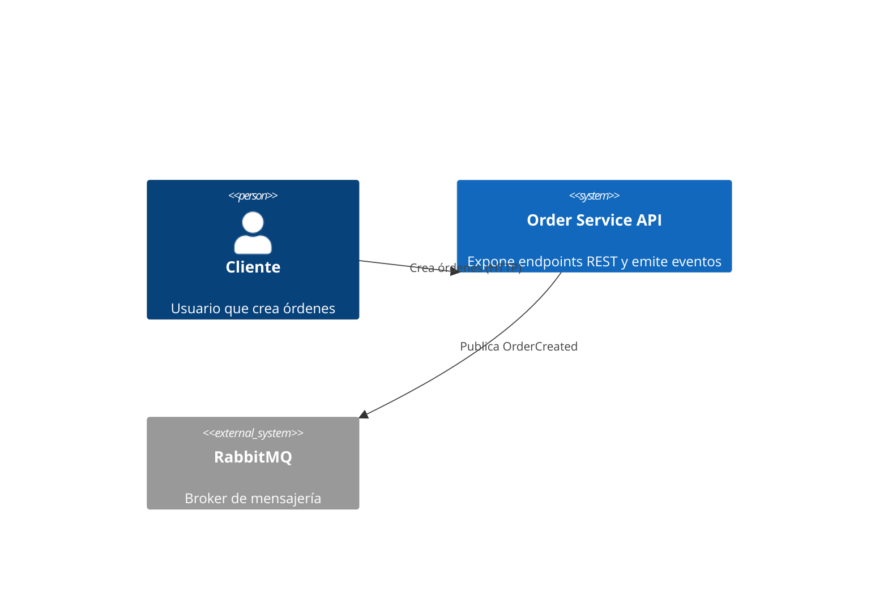
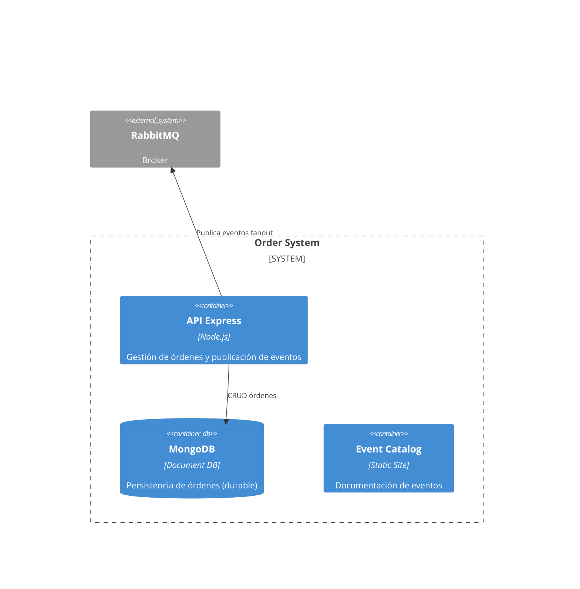
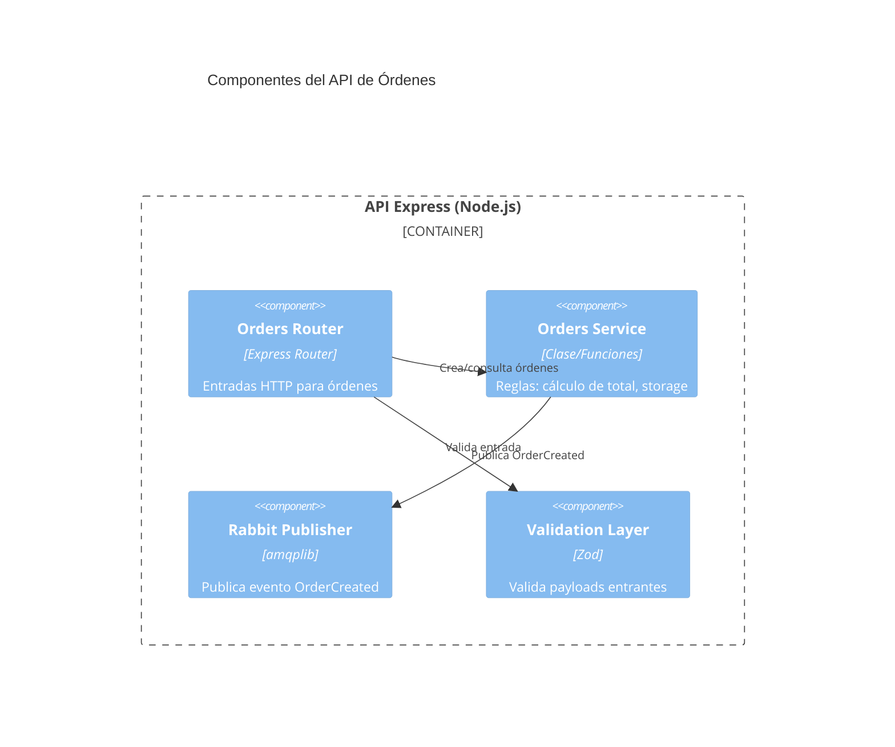

# 🧱 Proyecto: C4Model + OpenAPI + Event Catalog + Arquitectura Orientada a Eventos

Este repositorio contiene un ejemplo pedagógico completo que integra:

- API REST en **Node.js + TypeScript + Express**.
- Documentación **OpenAPI 3.0 (Swagger)**.
- **RabbitMQ** para publicación/consumo del evento `OrderCreated`.
- **Event Catalog** para documentar eventos y sus productores/consumidores.
- Diagramas **C4Model** con **Mermaid**.

> Objetivo educativo: brindar una guía práctica + teórica para estudiantes avanzados sobre cómo combinar documentación de arquitectura y especificaciones API/eventos.

## Índice
1. Introducción a Markdown
2. Arquitectura general del sistema
3. Fundamentos y filosofía del C4Model
4. C4Model aplicado al repositorio (diagramas y ejemplo práctico)
5. OpenAPI vs C4Model vs Event Catalog (cuándo usar cada uno)
6. API REST: Endpoints y flujo
7. Evento `OrderCreated` y arquitectura EDA
8. Ejecución paso a paso (API, RabbitMQ, Event Catalog, Swagger)
9. Pruebas (unitarias y end-to-end)
10. Desafío final
11. Futuras extensiones
12. Guía completa de ejecución
13. Estructura del proyecto
14. Scripts útiles
15. Lint OpenAPI (Spectral)
16. Flujo recomendado documentación de eventos
17. Fundamentos teóricos de Lints
18. Fundamentos teóricos de Unit Tests
19. Fundamentos teóricos de Scaffolding de Eventos

---
## 1. Introducción a Markdown
Markdown es un lenguaje de marcado ligero usado para escribir documentación de forma simple.

Ejemplos rápidos:

```markdown
# Título H1
## Título H2
**Negrita** y *cursiva*
`inline code`

```bash
echo "Bloque de código con sintaxis"
```

| Columna | Descripción |
|---------|-------------|
| A       | Ejemplo     |
| B       | Ejemplo     |


Consejos:
- Usá encabezados para estructurar.
- Listas numeradas vs bullets según orden.
- Tablas para comparaciones compactas.

---
## 2. Arquitectura general del sistema

El sistema permite crear órdenes mediante la API. Cada orden genera el evento `OrderCreated` para que otros servicios puedan reaccionar de forma desacoplada.

Flujo simplificado:
1. Cliente invoca `POST /orders`.
2. Servicio valida y crea la orden en memoria.
3. Publica `OrderCreated` en exchange `orders` (fanout) de RabbitMQ.
4. Consumidor interno registra el evento (logging). Futuro: facturación, inventario.

---
## 3. Fundamentos y filosofía del C4Model
El C4 Model nace de una necesidad práctica: comunicar arquitectura de manera que un desarrollador recién incorporado pueda orientarse en minutos, mientras que un stakeholder no técnico obtiene una vista de valor sin ahogarse en detalles. Según su autor Simon Brown (ver sitio oficial https://c4model.com), la clave es una jerarquía de abstracciones (Sistema → Contenedores → Componentes → Código) y la noción de “zoom” progresivo. No se busca reemplazar documentación textual, sino darle una columna vertebral visual y coherente. La intención principal es reducir ambigüedad: en vez de diagramas genéricos repletos de cajitas sin significado uniforme, C4 define tipos de elementos y su semántica.

Los principios esenciales pueden resumirse así: (a) cada nivel introduce el mínimo detalle adicional necesario; (b) los diagramas deben ser entendibles sin un narrador presente; (c) las relaciones importan tanto como los elementos; y (d) la herramienta es secundaria: la semántica prima sobre el estilo. Esto conduce a una documentación viva: el modelo acompaña el código en el repositorio y evoluciona con él.

Profundizando en los niveles: el diagrama de Contexto responde “¿qué sistema estamos construyendo y con quién interactúa?”. Es ideal para conversaciones con personas de negocio o equipos vecinos. El diagrama de Contenedores revela la macroestructura: servicios desplegables, bases de datos, frontends, colas, etc. Aquí se justifican decisiones como usar un broker de mensajería o separar el frontend del backend. El nivel de Componentes (que a veces se limita a dominios críticos) ofrece a los desarrolladores una guía de organización lógica interna: módulos, adaptadores, capas. Finalmente, el nivel de Código puede representarse opcionalmente para piezas sensibles (por ejemplo, un algoritmo de optimización o un pipeline complejo), pero no pretende duplicar el javadoc/clases: se enfoca en resaltar patrones y dependencias clave.

Buenas prácticas: vocabulario consistente, protocolos sólo donde aportan, densidad moderada, sincronizar diagramas con texto. Anti‑patrones: mezclar niveles, “diagramas decorativos” sin semántica, hiper‑documentar desde el inicio, no actualizar tras refactors.

Relación con otros artefactos: C4 convive con OpenAPI (contratos de interfaz), Event Catalog (semántica/eventos), ADR (decisiones históricas) y tests de arquitectura (validación automática de límites). Estrategia sostenible: actualizar en PRs relevantes, revisión periódica, automatización mínima para render, versionado coherente, señalización de elementos transitorios.

Evolución incremental ejemplificada: MVP con un solo contenedor; escalado introduciendo broker y worker; dominio complejo agregando nuevos bounded contexts y capas anticorrupción.

Checklist de calidad razonado: título claro, propósito en cada caja, ausencia de constructos de nivel inferior, etiquetas sólo para relaciones no obvias, estilo consistente, actualización reciente.

Integración con eventos y APIs: C4 muestra topología y relaciones; Event Catalog detalla payloads y versionado; OpenAPI define la superficie sincrónica. Flujo: `POST /orders` → persistencia → publicación `OrderCreated` → consumidores.

Herramientas y formato: Mermaid para edición ligera; Structurizr DSL para portafolios grandes; PlantUML como alternativa madura. Todas deben generar texto versionable.

## 4. C4Model aplicado al repositorio (diagramas y ejemplo práctico)

**C4Model** aplicado aquí describe arquitectura en 4 niveles (Context, Container, Component, Code opcional). A continuación se muestran los diagramas reales del proyecto.

### 4.1 Context Diagram


### 4.2 Container Diagram


### 4.3 Component Diagram (API principal)


### 4.4 Cuándo usar cada nivel (resumen)
Context: stakeholders no técnicos.
Container: decisiones de infraestructura y despliegue.
Component: organización interna para devs.
Code: piezas críticas (opcional).

---
## 5. OpenAPI vs C4Model vs Event Catalog

| Herramienta | Propósito | Enfoque |
|-------------|----------|---------|
| C4Model | Arquitectura macro y micro | Relaciones y límites |
| OpenAPI | Contrato de la API REST | Endpoints, schemas, responses |
| Event Catalog | Documentación de eventos | Productores, consumidores, payload |

Reglas prácticas:
- Cambios de endpoints => actualizar OpenAPI.
- Nuevos eventos o campos => actualizar Event Catalog.
- Nuevos servicios/contenedores => actualizar C4Model.

### 5.1 Fundamentos teóricos de OpenAPI (Swagger)
**Propósito**: establecer un contrato claro, versionable y verificable entre productores y consumidores de una API HTTP. OpenAPI describe recursos, operaciones, parámetros, esquemas de datos y respuestas, permitiendo tooling automático.

**Pilares conceptuales**:
- Especificación neutral al lenguaje (YAML/JSON) que modela interfaz, no implementación.
- Fomenta diseño primero (design-first) o código primero (code-first) — ambos válidos si se mantiene sincronía.
- Sirve como única fuente de verdad para: documentación, generación de SDKs, validación de requests/responses, pruebas contractuales, mocks.

**Elementos clave**:
- Paths & Operations (CRUD semántico + verbos HTTP correctos).
- Schemas (componentes reutilizables, composición `allOf/oneOf` para evolución gradual).
- Security (schemes: bearer, oauth2, apiKey) centralizadas.
- Versionado: usar `info.version` + control de breaking changes (compatibilidad hacia atrás en campos opcionales).

**Beneficios**:
- Reduce ambigüedad y alinea expectativas tempranamente.
- Habilita mocks tempranos para frontends móviles/web.
- Facilita pruebas contractuales CI (fail rápido en desalineaciones).
- Soporta gobernanza: se pueden aplicar linters (Spectral) para políticas (naming, códigos HTTP, paginación estándar).

**Limitaciones**:
- No cubre semántica de procesos asincrónicos ni coreografía de eventos.
- Puede desactualizarse si no se integra al pipeline (anti‑patrón: "documentación histórica").
- Describe estructura, no latencias reales, SLAs o políticas de resiliencia.

**Buenas prácticas**:
1. Nombrar recursos en plural (`/orders`, `/customers`).
2. Usar códigos HTTP coherentes (201 creación, 204 sin cuerpo, 400 validación, 404 inexistente, 409 conflicto, 422 semántica, 500 error interno).
3. Incluir ejemplos (`examples`) realistas para acelerar onboarding.
4. Mantener backward compatibility: sólo agregar campos opcionales, nunca retirar sin ciclo de deprecation.
5. Añadir descripciones claras en cada schema y enumeración.
6. Validar en CI: lint + diff semántico.
7. Documentar paginación, filtros y ordenamiento de forma consistente.

### 5.2 Fundamentos teóricos de Event Catalog
**Propósito**: centralizar conocimiento de eventos de dominio (qué significan, quién los produce, quién los consume, su esquema y motivación) para facilitar descubrimiento y evolución en arquitecturas event-driven.

**Conceptos clave**:
- Evento como hecho inmutable con significado de negocio (no sólo transporte de datos).
- Productores y consumidores desacoplados: documentación ayuda a evitar dependencias implícitas.
- Versionado evolutivo: agregar campos opcionales antes de introducir cambios incompatibles (o usar nuevo nombre de evento).
- Esquemas autodocumentados: JSON Schema / Avro / Protobuf referenciados desde cada entrada.

**Beneficios**:
- Descubribilidad: nuevos equipos encuentran eventos existentes antes de crear duplicados semánticos.
- Trazabilidad conceptual: se registra la intención (por qué existe el evento) y no sólo su estructura.
- Alineación con datos analíticos: eventos bien definidos pueden alimentar data lakes sin reinterpretaciones.

**Limitaciones**:
- No reemplaza monitoreo en tiempo real ni trazas distribuidas.
- Puede convertirse en catálogo muerto si no se integra a PRs (igual que OpenAPI).
- Sin un proceso de revisión, puede proliferar vocabulario inconsistente.

**Buenas prácticas**:
1. Nombrar eventos en pasado: `OrderCreated`, `OrderCancelled` (reflejan hechos consumados).
2. Incluir contexto mínimo: fuente, timestamp, idempotency key (si aplica), versión de esquema.
3. Adjuntar ejemplo de payload válido y, si corresponde, contraejemplo.
4. Mantener un registro de cambios (changelog) por evento para auditar compatibilidad.
5. Relacionar eventos con agregados / bounded contexts (ubicar en mapa de dominio).
6. Indicar consumidores conocidos y su propósito (observabilidad de impacto de cambios).
7. Definir estrategia de versionado (v1/v2) o additive-only + flags de deprecation.

**Integración con el flujo de desarrollo**:
- Pull Request que agrega/edita evento debe actualizar su entrada en el catálogo.
- CI puede validar que cada evento referenciado en código exista en el catálogo.
- Automatizar render estático para alojar la documentación (GitHub Pages, etc.).

**Comparativa rápida OpenAPI vs Event Catalog**:
- OpenAPI: contrato sincrónico (request/response); foco en endpoints y códigos de estado.
- Event Catalog: hechos asincrónicos; foco en semántica de negocio e impacto.
- Ambos: deben versionarse y validarse; complementarios, no excluyentes.

---
## 6. API REST: Endpoints y flujo

Endpoints principales (actualizados con Mongo y operaciones adicionales):
- `GET /health`
- `GET /orders` (lista todas)
- `GET /orders/{id}` (detalle)
- `POST /orders` (crea orden + emite OrderCreated)
- `PUT /orders/{id}` (actualiza items y recalcula total)
- `DELETE /orders/{id}` (cancela orden: status=CANCELLED, prepara futuro OrderCancelled)
- `GET /orders/search?customer=NAME` (búsqueda por cliente)
 - `GET /orders/stats` (estadísticas agregadas: count, totalRevenue, avgOrderValue)

Validación: Zod asegura estructura y tipos.

### 6.1 Troubleshooting avanzado (routing y ObjectId)
Caso real: se agregó el endpoint `/orders/stats` y la aplicación devolvía un error `CastError: Cast to ObjectId failed for value "stats"`. Causa: en Express, la ruta paramétrica `/:id` estaba registrada antes que `/stats`, capturando la cadena literal "stats" como si fuera un id de Mongo.

Prevención y solución:
1. Declarar rutas concretas (como `/stats` o `/search`) **antes** de las rutas con parámetros (`/:id`).
2. Validar el formato del id antes de invocar Mongoose: `mongoose.Types.ObjectId.isValid(id)` y responder `400 Invalid id format` si es inválido.
3. Mantener un middleware de error global que atrape excepciones y evite que el proceso muera.

Snippet conceptual:
```ts
ordersRouter.get('/stats', handlerStats); // fijo
ordersRouter.get('/:id', (req,res)=> { if(!isValid(req.params.id)) return res.status(400).json({error:'Invalid id format'}); /* ... */ });
```

Checklist rápido al agregar nuevos endpoints bajo `/orders`:
- ¿El nuevo path podría confundirse con un `:id`? Colocarlo antes.
- ¿Se validan todos los ids? Usar `ObjectId.isValid`.
- ¿Hay tests de smoke para el nuevo endpoint? Agregarlos.
- ¿Actualizaste OpenAPI (`openapi.yaml`) y README? Sincronizar documentación.

Beneficio: evita crashes por casteos de Mongoose y hace visibles errores de input del cliente tempranamente.

---
## 7. Evento `OrderCreated` y arquitectura EDA

Exchange `orders` (tipo fanout) distribuye el evento a múltiples colas. Consumidor inicial: logger. Potenciales consumidores: facturación, inventario, analytics.

Beneficios EDA:
- Desacoplamiento temporal y espacial.
- Escalado independiente de productores y consumidores.
- Extensibilidad: agregar nuevos consumidores sin modificar el productor.

---
## 8. Ejecución (resumen rápido)

### Prerrequisitos
- Node.js 18+
- Docker + Docker Compose

### 8.1 Levantar RabbitMQ
```bash
docker compose up -d rabbitmq
```
UI de gestión: http://localhost:15672 (guest/guest).

### 8.2 Instalar dependencias
```bash
npm install
```

### 8.3 Iniciar API (con Mongo y Swagger embebido)
```bash
npm run dev
```
La documentación OpenAPI estará disponible en `http://localhost:3100/docs` (Swagger UI). Si el puerto 3000 está ocupado por otro servicio local, el servidor utilizará 3100.

Si no tenés Mongo corriendo localmente, podés usar Docker rápido:
```bash
docker run -d --name mongo -p 27017:27017 mongo:6
```

### 8.4 Crear una orden (ejemplo mínimo)
```bash
curl -X POST http://localhost:3100/orders \
	-H 'Content-Type: application/json' \
	-d '{"customerName":"Juan","items":[{"sku":"ABC","quantity":2,"price":10}]}'
```

### 8.5 Ver evento en logs
Al crear una orden (`POST /orders`) se publica un mensaje en el exchange `orders` (tipo `fanout`). El consumidor definido en `src/messaging/rabbit.ts` crea/usa la cola `orders.created.log` y registra cada evento recibido.

Pasos para verificar:
1. Asegurate de tener RabbitMQ levantado: `docker compose up -d rabbitmq`.
2. Arrancá la API: `npm run dev` (verás en consola `MongoDB connected` y `RabbitMQ initialized`).
3. Crea una orden de prueba:
	```bash
	curl -X POST http://localhost:3100/orders \
	  -H 'Content-Type: application/json' \
	  -d '{"customerName":"LogTest","items":[{"sku":"X","quantity":1,"price":5}]}'
	```
4. Observá la consola del proceso: debería aparecer una línea similar a:
	```
	[Consumer] OrderCreated received: 68f64... (ID de la orden)
	```
5. Opcional: ingresá a la UI de RabbitMQ `http://localhost:15672` (guest/guest) → pestaña Queues → selecciona `orders.created.log` para ver el número de mensajes (normalmente 0 si ya se consumieron).

Logs esperados (ejemplo):
```
RabbitMQ initialized
[Consumer] OrderCreated received: 68f6412b11e09e3e143d4f49
```

Si ves el warning:
```
RabbitMQ channel not ready, skipping publish
```
Significa que la orden se creó antes de que la conexión a RabbitMQ estuviera lista; el evento no se publicó. Reintentá luego de ver `RabbitMQ initialized`.

Troubleshooting rápido:
- `ECONNREFUSED amqp://localhost`: RabbitMQ no está levantado → ejecutar compose.
- No aparece el log del consumidor: confirma que `DISABLE_RABBITMQ` no está en `true` y que el puerto 5672 no está bloqueado.
- Cola sin mensajes: el consumidor hace `ack` inmediatamente; para inspeccionar payloads detené temporalmente el ack (solo para depurar) o crea una segunda cola con otra binding.

#### Extender logs para nuevos eventos
Cuando agregues nuevos eventos (ej. `OrderCancelled`, `OrderShipped`), seguí estos pasos para que aparezcan en los logs:

1. **Publicar el evento**: En el servicio correspondiente (ej. `orders.service.ts`), invocar la función de publicación del nuevo evento (similar a `publishOrderCreated`).

2. **Crear consumidor**: En `src/messaging/rabbit.ts`, agregar una nueva función `setupConsumerNombreEvento()` que:
   - Declara/usa una cola específica (ej. `orders.cancelled.log`)
   - Hace binding al exchange correspondiente
   - Registra el mensaje recibido en consola con el formato `[Consumer] NombreEvento received: <id>`

3. **Invocar en inicialización**: Llamar a la nueva función setup desde `initRabbit()` para que el consumidor esté activo al iniciar la aplicación.

4. **Verificar**: Crear una acción que dispare el evento (ej. `DELETE /orders/{id}` para `OrderCancelled`) y observar la consola.

**Patrón recomendado**:
```typescript
async function setupOrderCancelledConsumer() {
  if (!channel) return;
  const q = await channel.assertQueue('orders.cancelled.log', { durable: true });
  await channel.bindQueue(q.queue, 'orders', '');
  await channel.consume(q.queue, (msg) => {
    if (!msg) return;
    const order = JSON.parse(msg.content.toString());
    console.log('[Consumer] OrderCancelled received:', order.id);
    channel!.ack(msg);
  });
}
```

Esta estrategia mantiene un registro centralizado y observable de todos los eventos del dominio sin necesidad de herramientas externas complejas en etapas tempranas del desarrollo.

### 8.6 Live reload de Swagger UI (opcional)
La API ya expone automáticamente la documentación en `http://localhost:3100/docs` al iniciar (no tenés que hacer nada extra). Este paso es **opcional** sólo si querés trabajar en modo *live reload* sobre `openapi.yaml` y ver los cambios al guardar sin reiniciar la API.

Instalá y ejecutá el watcher para edición rápida:
```bash
npm run swagger
```
Abrí UI generada (instrucciones en terminal).

### 8.7 Event Catalog
Desarrollo: `npm run catalog:dev` (sirve contenido). Build estático: `npm run catalog:build`.
La herramienta convierte `.md` a `.mdx` automáticamente al iniciar; usar `.mdx` para nuevos documentos.

#### Ver el Event Catalog como frontend (similar a Swagger)
Swagger UI se genera a partir de `openapi.yaml`; el Event Catalog genera un sitio Astro.

Modos de visualización:
1. Desarrollo interactivo: `npm run catalog:dev` → abre (o podés navegar a) `http://localhost:3000`.
2. Build estático: `npm run catalog:build` genera carpeta `.eventcatalog-core/dist` (o similar) lista para publicar en GitHub Pages / Netlify / Vercel.
3. Preview del build: `npx eventcatalog preview` (sirve el contenido ya compilado).

Publicación rápida en GitHub Pages (ejemplo):
1. Ejecutar build: `npm run catalog:build`.
2. Crear branch `gh-pages` y copiar contenido del directorio de salida.
3. Habilitar Pages apuntando a ese branch.

Buenas prácticas de hosting:
- Cache corto para HTML, largo para assets (JS/CSS).
- Incluir link desde README principal al catálogo desplegado.
- Automatizar build en CI (GitHub Action) cuando cambian archivos bajo `eventcatalog/events/`.

Integración con flujo: cada PR que agrega evento debe pasar por revisión y luego actualizar el sitio estático (deploy automático).

#### Cómo levantamos el frontend del Event Catalog
El "frontend" del Event Catalog es un sitio Astro generado dinámicamente a partir de la carpeta `eventcatalog/`.

Pasos concretos:
1. Verificá que existan subcarpetas bajo `eventcatalog/events/` con al menos `README.md` y `event.json`.
2. Ejecutá modo desarrollo:
	```bash
	npm run catalog:dev
	```
	Observá la consola hasta ver `astro  ready` y la URL `http://localhost:3000/`.
3. Si el puerto 3000 está ocupado y el servidor intenta usar otro, forzá un puerto alternativo:
	```bash
	npx eventcatalog dev -- --port=4000
	```
4. Abrí el navegador en la URL indicada; navegá a `Discover > Events` para listar eventos.
5. Cuando termines documentación, generá build estático:
	```bash
	npm run catalog:build
	```
	El output (`.eventcatalog-core/dist/`) se puede publicar en un hosting estático.

Definición de un evento en este catálogo:
- `event.json`: metadatos (name, version, producer, tags, visibility, schemaFile).
- `README.md`: semántica de negocio, tabla de campos, ejemplos, motivación, versionado, idempotencia, riesgos.
- `schema.json`: contrato formal (JSON Schema) alineado al ejemplo.

Checklist al definir un nuevo evento:
| Ítem | Estado mínimo |
|------|---------------|
| Nombre en pasado | `OrderCancelled`, `PaymentAuthorized` |
| Metadatos en `event.json` | producer + version + tags |
| Ejemplo de payload | JSON válido completo |
| Estrategia de compatibilidad | Additive-only o nueva versión |
| Changelog inicial | Fecha + v1 |
| Relación con servicio | Añadir al `service.json` correspondiente |

Errores comunes y solución:
- No aparece el evento: falta `event.json` o error de sintaxis → revisar consola dev (mensajes `[content]`).
- El sitio no carga: proceso muerto → reiniciar `npm run catalog:dev`.
- Puerto ocupado: usar flag `-- --port=<otro>`.

Automatización futura sugerida: script CI que valide que cada carpeta de evento contenga los tres archivos clave y que el ejemplo respete el `schema.json`.

---
## 9. Pruebas (unitarias y end-to-end)

Pruebas unitarias recomendadas:
- Cálculo de total en `Orders Service`.
- Validación Zod.

E2E con Supertest:
- POST /orders crea y retorna 201.
- GET /orders/{id} retorna 200.

Ejecutar:
```bash
npm test
```

---
## 10. Desafío final 

Objetivo: Mejorar la calidad y mantenibilidad de la documentación (OpenAPI + Event Catalog) sin agregar lógica compleja.

Entregables requeridos:
1. Crear la página del evento `OrderCancelled` sólo a nivel documental (usar la plantilla en `eventcatalog/events/_template/`). No es necesario implementar el evento en código.
2. Agregar en `eventcatalog/events/OrderCreated/README.md` un breve enlace cruzado (ver también OrderCancelled).
3. Añadir un `schemaVersion` opcional al ejemplo de payload de `OrderCreated` en el catálogo (sólo documento, no código) y explicar regla de compatibilidad.
4. En `openapi.yaml`, agregar descripción ampliada al endpoint DELETE /orders indicando que (en una versión futura) emitirá `OrderCancelled` y enlazar al Event Catalog.
5. Incorporar una nota en la sección 7.6 del README apuntando a cómo extender los logs cuando se añadan nuevos eventos.
 6. Registrar el nuevo endpoint `GET /orders/stats` en OpenAPI (ya agregado como ejemplo en el repositorio) explicando su objetivo pedagógico (mostrar agregación básica).
 7. Documentar `OrderCancelled` y añadirlo a `service.json` bajo `publishedEvents` para el `Order Service`.
 8. Verificar que el Event Catalog muestre ambos eventos (`OrderCreated`, `OrderCancelled`) en `Discover > Events`.

Aceptación (checklist):
- [ ] Archivo `eventcatalog/events/OrderCancelled/README.md` creado usando la plantilla.
- [ ] Enlace cruzado entre eventos existente.
- [ ] Ejemplo de `schemaVersion` agregado a OrderCreated (documental).
- [ ] Descripción DELETE /orders actualizada en OpenAPI.
- [ ] Nota agregada en README sección 7.6.
- [ ] Endpoint `GET /orders/stats` documentado y visible en OpenAPI (incluye summary, description, response schema).
- [ ] Evento `OrderCancelled` registrado (event.json + README + schema.json si aplica) y referenciado en `service.json`.
- [ ] Catálogo muestra ambos eventos y links cruzados.

Tip: Mantener lenguaje consistente y usar tiempo pasado en nombres de eventos.


---
## 11. Guía completa de ejecución
Esta sección concentra todos los comandos (el resumen anterior evita duplicación). Puerto por defecto: `3100`.

### Convenciones de nombrado (resumen)
| Tipo | Regla | Ejemplos |
|------|-------|----------|
| Recursos REST | Plural, lowercase, guiones para separar | `/orders`, `/customer-accounts` |
| Eventos de dominio | Pasado, CamelCase | `OrderCreated`, `OrderCancelled` |
| Schemas OpenAPI | PascalCase singular | `Order`, `CreateOrderInput` |
| Exchanges RabbitMQ | Sustantivo plural dominio | `orders` |
| Queues RabbitMQ | `<dominio>.<acción>.<propósito>` | `orders.created.log` |

Ubicación catálogo de eventos principal: `eventcatalog/events/OrderCreated/`.
Plantilla para nuevos eventos: `eventcatalog/events/_template/` (usar script `npm run scaffold:event NombreEvento`).

### Variables de entorno
Crear archivo `.env` (opcional) en la raíz:
```
PORT=3100
MONGO_URL=mongodb://localhost:27017/ordersdb
RABBITMQ_URL=amqp://localhost
DISABLE_RABBITMQ=false
```
Para tests puedes desactivar RabbitMQ:
```
DISABLE_RABBITMQ=true
```

### Levantar infraestructura con Docker
RabbitMQ (compose incluido):
```bash
docker compose up -d rabbitmq
```
MongoDB (contenedor rápido):
```bash
docker run -d --name mongo -p 27017:27017 mongo:6
```

### Instalar dependencias
```bash
npm install
```

### Ejecutar en desarrollo (hot reload)
```bash
npm run dev
```

### Ver documentación OpenAPI
- Abrir `http://localhost:3100/docs`
- Para editar la especificación: modificar `openapi.yaml` y refrescar.

### Event Catalog
Inicializar (si no existe estructura completa):
```bash
npm run eventcatalog
```
Luego navegar a la carpeta `eventcatalog/` para agregar más eventos.

### Crear una orden
```bash
curl -X POST http://localhost:3100/orders \
	-H 'Content-Type: application/json' \
	-d '{"customerName":"Maria","items":[{"sku":"SKU1","quantity":2,"price":10}]}'
```

### Actualizar una orden
```bash
curl -X PUT http://localhost:3100/orders/{ID} \
	-H 'Content-Type: application/json' \
	-d '{"items":[{"sku":"SKU1","quantity":3,"price":10}]}'
```

### Cancelar una orden
```bash
curl -X DELETE http://localhost:3100/orders/{ID}
```

### Buscar órdenes por cliente
```bash
curl 'http://localhost:3100/orders/search?customer=maria'
```

### Ejecutar tests
```bash
npm test
```

### Build y ejecución en producción
```bash
npm run build
npm start
```

### Health Check
```bash
curl http://localhost:3100/health
```

### Logs de eventos
Para ver recepción de `OrderCreated`, observar la consola de la API. Para explorar mensajes y colas ingresar a `http://localhost:15672` (guest/guest).

### Limpieza rápida
```bash
docker stop mongo && docker rm mongo
docker compose down
```

---
## 12. Estructura del proyecto
```
├─ src/
│  ├─ index.ts
│  ├─ app.ts
│  ├─ orders/
│  ├─ messaging/
│  └─ db/
├─ eventcatalog/
│  └─ events/
├─ diagrams/
├─ openapi.yaml
├─ Dockerfile
├─ docker-compose.yml
├─ .spectral.yaml
├─ .env.example
└─ scripts/scaffold-event.mjs
```

## 13. Scripts útiles
| Script | Descripción |
|--------|-------------|
| `npm run dev` | API modo desarrollo |
| `npm run build` | Compila TypeScript |
| `npm start` | Ejecuta build compilado |
| `npm run swagger` | Live reload OpenAPI UI |
| `npm run catalog:dev` | Event Catalog dev |
| `npm run catalog:build` | Build estático Event Catalog |
| `npm run lint:openapi` | Lint sobre openapi.yaml (Spectral) |
| `npm run scaffold:event NombreEvento` | Crea evento desde plantilla |

## 14. Lint OpenAPI (Spectral)
Reglas en `.spectral.yaml`. Ejecutar:
```bash
npm run lint:openapi
```
Usar en CI para evitar drift y malas prácticas.

## 15. Flujo recomendado documentación de eventos
1. Diseñar nombre y semántica (pasado: OrderCreated).
2. `npm run scaffold:event NuevoEvento`.
3. Completar README del evento (tabla de campos, ejemplo, motivación).
4. Añadir `schema.json` si aplica y actualizar OpenAPI si hay relación.
5. Revisar sección de logs del README para anotar cómo visualizarlo.
6. Crear PR incluyendo cambios en código y catálogo.

Mantener consistencia evita duplicar eventos o romper consumidores.

---
## 17. Fundamentos teóricos de Lints
El "linting" es un proceso automático que analiza código o artefactos de especificación buscando incumplimientos de convenciones, errores comunes y patrones potencialmente problemáticos. Su propósito central es **estandarizar calidad** y reducir defectos antes de tiempo.

### Tipos de lint
- Estático de código: analiza AST (ej. ESLint) para detectar variables sin uso, estilos incoherentes, riesgo de bugs.
- De especificación/contrato: valida estructura semántica (Spectral para OpenAPI: códigos HTTP correctos, nombres uniformes, uso de componentes reutilizables).
- De seguridad básico: detecta uso de APIs inseguras, expresiones regulares peligrosas.
- De estilo y formato: spacing, naming, imports ordenados.

### Beneficios
1. Shift-left: problemas se detectan antes de ejecución/test.
2. Consistencia multi-equipo: reglas compartidas permiten mantener un "dialecto" de código.
3. Apoyo al onboarding: nuevos miembros ven retroalimentación inmediata sin revisar guías largas.
4. Gobernanza: facilita aplicar políticas (por ejemplo, todos los endpoints requieren descripción y ejemplos en OpenAPI).

### Buenas prácticas
- Ejecución obligatoria en CI (fallar el build si hay errores críticos).
- Separar severidades: error (bloquea), warning (informativo), info (educativo).
- Documentar reglas custom en el README para transparencia.
- Minimizar overrides y desactivaciones inline (solo casos justificados).
- Mantener reglas evolutivas: agregar nuevas de forma incremental para evitar grandes bursts de cambios.

### ESLint vs Spectral
| Herramienta | Objeto | Ejemplos de reglas |
|-------------|--------|--------------------|
| ESLint | Código TypeScript/JS | No unused vars, prefer const, evitar any | 
| Spectral | OpenAPI YAML/JSON | OperationId requerido, uso de componentes, códigos HTTP estándar |

### Errores comunes evitados
- Endpoints sin descripción (dificultan Swagger UI).
- Schemas duplicados en OpenAPI (rompe DRY, mayor mantenimiento).
- Uso de `any` que oculta incompatibilidades de tipos.
- Códigos HTTP ambiguos (usar 200 en creación en vez de 201).

### Integración continua
Ejecutar:
```bash
npm run lint:openapi
```
Agregar equivalente para ESLint (ya existe script `lint`). Integrar a pipeline (GitHub Actions) y publicar reporte.

---
## 18. Fundamentos teóricos de Unit Tests
Las pruebas unitarias verifican comportamientos de **unidades aisladas** (funciones, métodos) asegurando que lógica esencial permanezca correcta tras refactors.

### Pirámide de pruebas
- Unit (base, alta cantidad, rápida ejecución).
- Integration (validan interacción entre componentes, p.ej. servicio + DB real o simulada).
- End-to-End (flujo completo usuario → sistema). Menos numerosas por costo.

### Diferencias clave
| Tipo | Alcance | Velocidad | Fragilidad | Ejemplo |
|------|---------|----------|-----------|---------|
| Unit | Función pura | Muy alta | Baja | Calcular total orden |
| Integration | Módulos conectados | Alta | Media | Crear orden usando Mongo | 
| E2E | Sistema completo | Menor | Alta | POST /orders y verificar respuesta |

### Características de una buena prueba unitaria
1. Determinista (mismo resultado siempre).
2. Rápida (<100ms típico).
3. Clara (arreglo-acto-afirmación explícitos).
4. Independiente (no comparte estado con otras pruebas).
5. Nombrada por comportamiento (`calcula total acumulando price * quantity`).

### Anti‑patrones
- Sobre-mocking: mocks profundos que replican implementación → fragilidad.
- Pruebas mágicas: sin comentarios/contexto, difícil mantener.
- Flaky tests: dependencia de tiempo real, red o estado externo.
- Pruebas triviales (testean el lenguaje, no la lógica de negocio).

### Uso de Jest + Supertest
- Jest: assertions, isolation, mocks temporales.
- Supertest: simula HTTP sin necesidad de levantar servidor externo (usa instancia Express).
- Separar suites unit vs e2e para visibilidad (config distinto si necesitas). Ya existe `test` y `test:e2e` potencial.

### Estrategia de cobertura
Enfoque en caminos críticos: cálculo total, validación de payload, publicación de evento (mock canal Rabbit) y transformaciones de documentos. Cobertura >80% en dominio suele ser suficiente; evitar perseguir 100% con pruebas triviales.

### Evolución sostenible
Agregar pruebas junto a nuevas funcionalidades (Test-Commit o TDD ligero). Revisar métricas de tiempo: si suite <5s, vamos bien para retroalimentación rápida.

---
## 19. Fundamentos teóricos de Scaffolding de Eventos
El scaffolding automatiza la creación estandarizada de archivos y estructura de documentación para nuevos eventos. Evita variabilidad manual y omisiones.

### Motivaciones
1. Consistencia: misma plantilla reduce riesgo de olvidar campos (ej. ejemplo de payload, changelog).
2. Velocidad: desarrolladores crean docs iniciales en segundos.
3. Gobernanza: facilita revisar PR (estructura conocida).
4. Trazabilidad: naming uniforme facilita búsquedas y correlación en monitoreo.

### Componentes mínimos del scaffold
- Carpeta `eventcatalog/events/<Evento>`.
- `README.md` con secciones: descripción, tabla de campos, ejemplo, motivación, versionado, idempotencia, riesgos, changelog.
- `schema.json` (o enlace a fuente externa) con contrato formal.
- `event.json` metadata (nombre, versión, productor, tags, visibilidad, referencia al schema).

### Flujo sugerido para crear nuevo evento
```bash
npm run scaffold:event OrderCancelled
```
Luego completar los placeholders y agregar relación en `service.json` (`publishedEvents` o `consumedEvents`). Actualizar dominio y team para reflejar nuevo evento.

### Versionado y compatibilidad
Política recomendada: cambios aditivos (agregar campos opcionales). Para breaking changes: crear nuevo evento `EventNameV2` o añadir `schemaVersion` + mecanismo de fallback. Documentar la transición en changelog.

### Revisión en Pull Requests
Checklist rápido:
- Nombre en pasado correcto.
- `README.md` completo (sin placeholders).
- Ejemplo de payload válido.
- `schema.json` alineado al ejemplo.
- Referencias actualizadas en dominio, servicio y equipo.
- No se reutilizan eventos con semántica distinta (evitar sobrecarga de significado).

### Integración CI futura (ideas)
- Script que valida que cada evento tenga `event.json` y `README.md` completos.
- Validación de schemas (JSON Schema) para ejemplo de payload.
- Generación automática de changelog de eventos según diff.

### Anti‑patrones
- Reutilizar evento para caso de negocio distinto (rompe semántica).
- Saltar versionado en breaking changes (consumidores rotos silenciosamente).
- Payload excesivo (agregar campos irrelevantes a todos los consumidores).

### Beneficio estratégico
La estandarización reduce tiempo de alineación entre equipos y disminuye coste cognitivo para data engineers, QA y nuevos desarrolladores.

---
